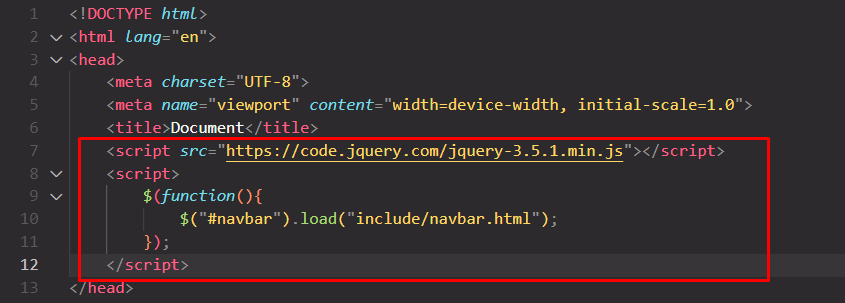
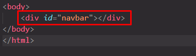

# WeHealthy
 Tugas HCI Lecturer


# Tutor Include Navbar

1.  Copy script dulu
    ```
    <script src="https://code.jquery.com/jquery-3.5.1.min.js"></script>
    <script>
        $(function(){
            $("#navbar").load("../include/navbar.html"); 
        });
    </script>
    ```

2. Paste script di file .html nya
   
   

4. Copy div ini 
   ```
   <div id="navbar"></div>
   ```
 
5. Paste div nya di body
   
   
